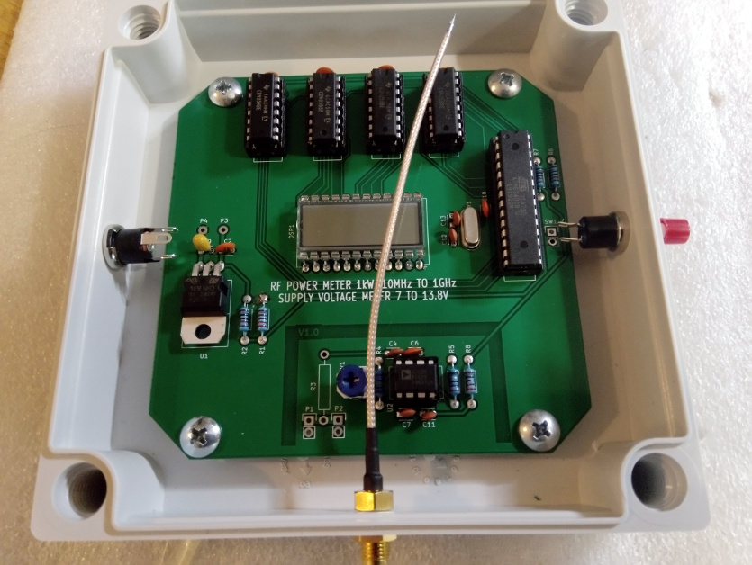
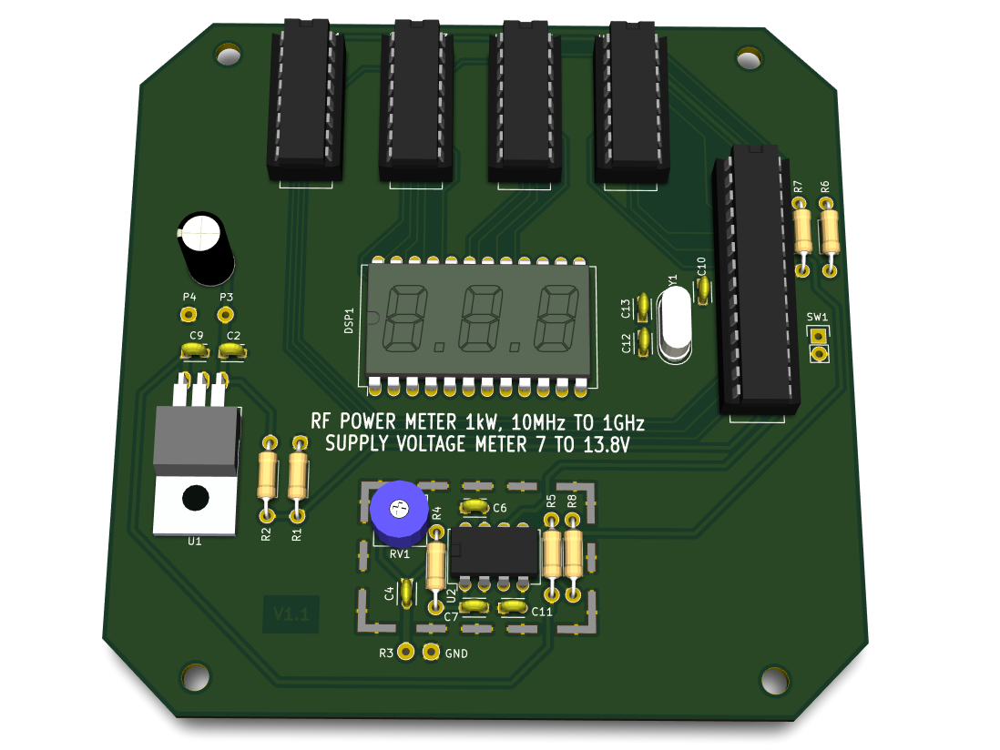
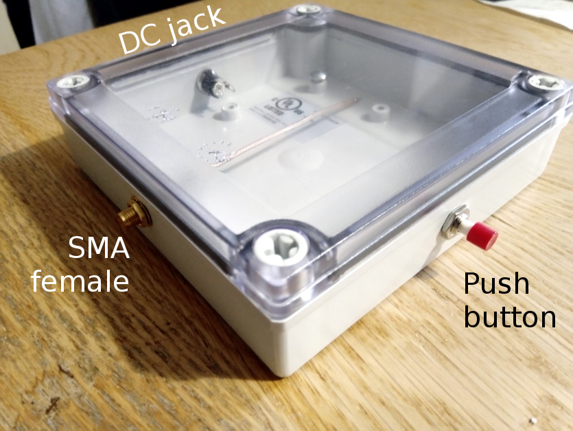
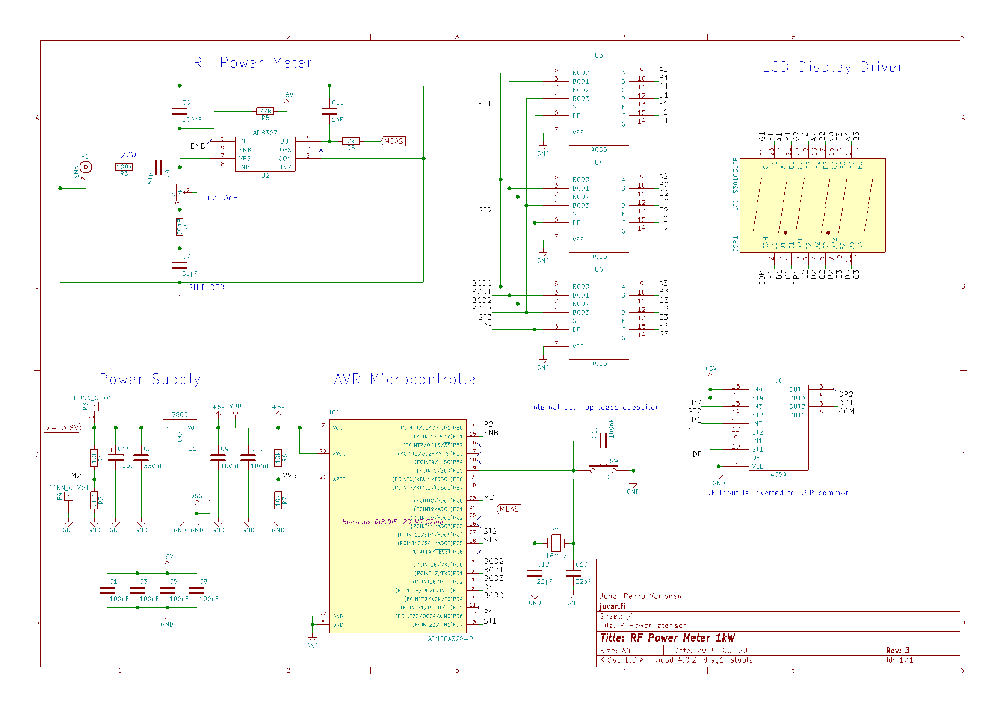
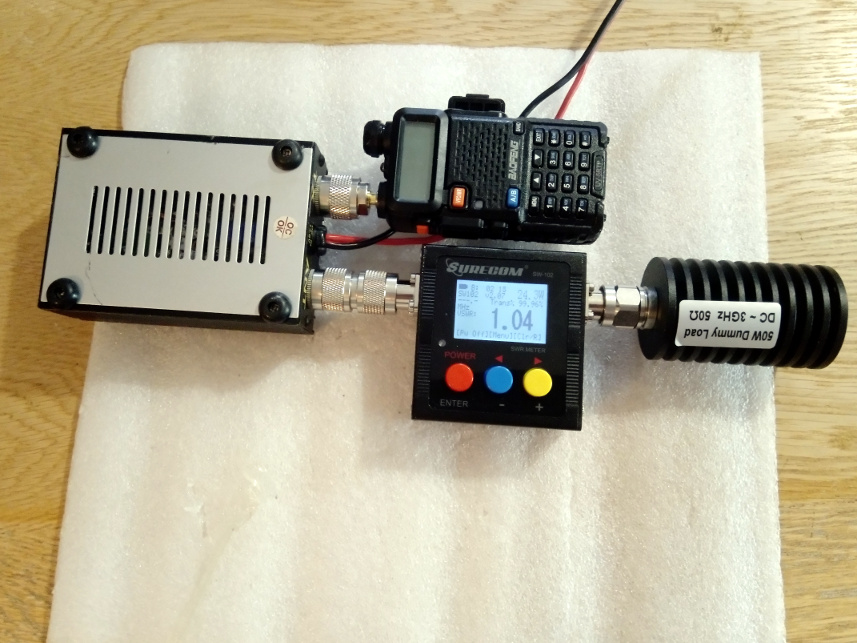

# RFPowerMeter
RF power meter and supply voltage meter for battery powered transmitter.

## First prototype

Version 1.0

## 3D image

Version 1.1

## Introduction

This meter measures the transmitting power of the radio transmitter and the voltage of the battery used as a power source. Power is displayed in watts and dBm. The device has a three-digit LCD display. The functions are controlled by a push button. The unit will automatically turn off after one minute if the button is not pressed. By pressing about 1-2 seconds device wakes from sleep mode and show measured power in watts. By pressing again device switches to dBm mode and show power in dBm. Pressing third time device show measured supply voltage. If voltage is over measuring range display shows '999'.

Comes as a bag of parts kit and is easily assembled if customer can follow the silkscreen indicators and have beginning experience with a soldering iron. Customer will need to read the resistor bands or use a multimeter to determine the resistor sizes.

Works with single 7…14 volts DC power supply connected with DC barrel plug. Internally 5.0V voltage is used through regulator 7805. ADC reference voltage is taken from supply voltage with voltage divider. Its voltage is 2.5V. One analog input is connected with supply voltage also with voltage divider. its voltage is adjusted to a max. of 2.5V at 14V so that accurate voltage measurement is made possible.

The heart of the device is AtMega328P-PU at 16MHz clock frequency. This makes it to be Arduino™ compatible system.

For measuring power, an AD8307 chip is used. It allows the RF power to be converted to a voltage between 0 and 2.5V. The permissible power is between 0 and 1kW. The permissible frequency range is between 10MHz and 1GHz. It is possible to calibrate the measuring range by ± 3dB with on-board trimmer resistor. The output is connected to the analog input of the microcontroller.

Measurement is made with following two equations:

dBm = 40(U-1)
 W = 10(dBm/10)/1000

The display is a three-digit LCD display. LCD display requires AC voltage. It can be simple square wave signal from DC 5V. Frequency is not critical. It can be between 30-200Hz. Phase difference lights the segment. This device uses regular CMOS series IC’s to control LCD segments. 4056 is used to control digits. Every digit needs own IC. One 4054 is used to control two decimal points and to invert common backplane signal. Frequency is made with Arduino™ PWM output. It is about 30Hz.

Current consumption is very low because of CMOS integrated circuits used and AtMega328P power saving mode which is programmatically activated. LCD display consumes very little current compared to regular LED display. Also power measurement circuit ’chip enable’ signal is controlled with AVR.

## Casing

Physical size of device is with casing 13x13cm. PCB is 10x10cm. Dimensions excludes connectors and push button. Case is bought from Digi-Key like all other parts. It’s part number is [PIP-11766-C](https://www.digikey.fi/product-detail/en/bud-industries/PIP-11766-C/377-2127-ND/4896970). DC jack outer diameter is 5.5mm and inner 2.5mm.

## Usage examples

- Amateur radio station power meter
- Power measurement

## Circuit diagram

Revision 3: Improved supply line and button noise immunity.
 Revision 2: Improved measuring circuit noise immunity.

## Development stage

One prototype has been ordered so far with double sided printed circuit board and with through hole components. It is designed with KiCad. Tested and working.

## Advantages

Ease of use. The device has only one button with three functions. ’Plug-and-play’. Safe operating voltage. Safe to use. Hackable design.

## Other similar devices

Surecom SW-102 Digital Antenna Power & SWR Meter VHF/UHF 125-525MHz. Used for reference and calibration.

## Soldering

The project requires no special soldering skills. All components are their through hole versions.

## Programming

All parts are open source. The program is solely written in C++. The program is very simple and with its 200 lines of code it uses only 4.6kB of program memory. AtMega328P-PU chip is used.

The bootloader must first be programmed using external programmer. I personally like to use Arduino™ as ISP and Arduino™ IDE. Be sure to choose the Arduino™ Uno from the Tools→Board menu. After installing the bootloader, the program can be uploaded using same setup.

Program does not use any external libraries. Only standard built-in power saving related libraries are used.

## Approvals

Arduino is a registered trademark. It is still ok to build a commercial product based on Arduino. Only the name may not be the same. https://www.arduino.cc/en/Main/FAQ#toc10
